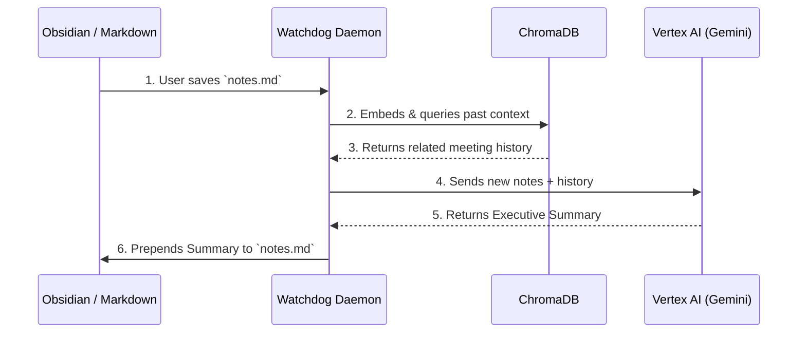

# Memex: Examples & Usage

Memex ensures you never lose context by automatically summarizing and linking your chaotic meeting notes.

## The Architecture



---

## 1. Auto-Synthesizing a Meeting Note

You start the background daemon, and then drop a messy meeting note into your vault.

**The Command:**
```bash
$ python watcher.py --dir ~/my-vault
👀 Watching directory: /home/gio/my-vault
Press Ctrl+C to stop.
```

**The Raw Input (`kickoff.md`):**
```markdown
# Client Kickoff
The client is really worried about data ingestion speeds. They want to make sure we can handle 10k rows per second.
We need to set up a Go backend ASAP.
Update: They also want a dashboard in React.
```

**The Background Execution:**
```text
📝 Detected modification: /home/gio/my-vault/kickoff.md
🔍 Generating embeddings and searching vault context...
🧠 Asking Gemini to synthesize...
✅ Synthesis injected successfully!
```

**The Final Result (`kickoff.md`):**
```markdown
### 🤖 FDE Executive Summary
**Context:** Client kickoff discussing high-throughput ingestion.
**Financial Impact:** High priority to prevent SLA breaches on data lag.

**Action Items**
* [ ] Scaffold high-performance Go backend (Target: 10k rows/sec).
* [ ] Provision React dashboard architecture.

---

# Client Kickoff
The client is really worried about data ingestion speeds. They want to make sure we can handle 10k rows per second.
We need to set up a Go backend ASAP.
Update: They also want a dashboard in React.
```
